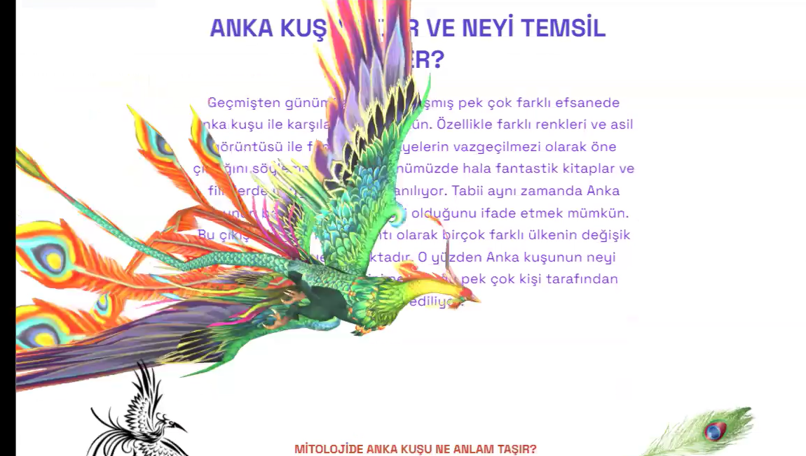
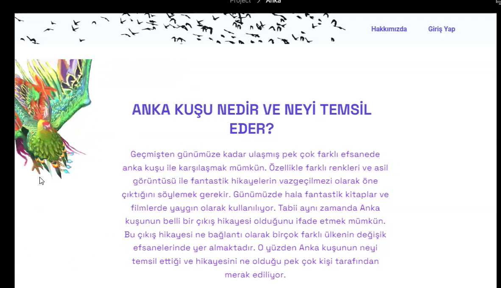
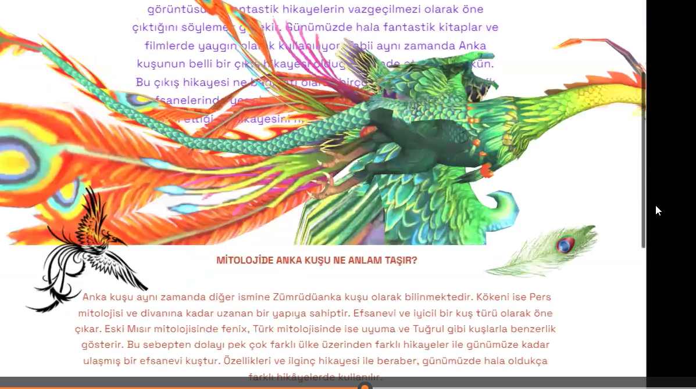
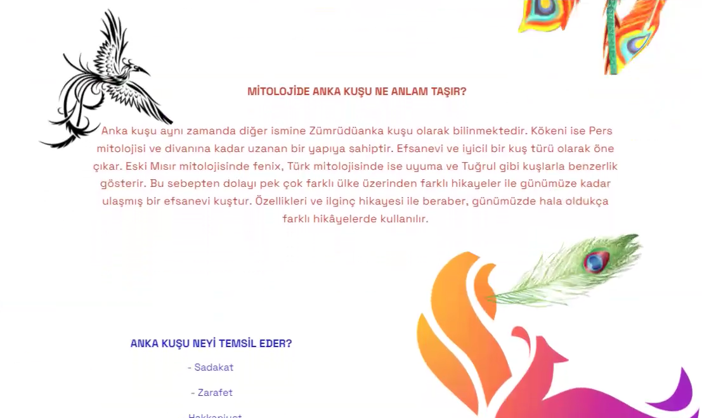
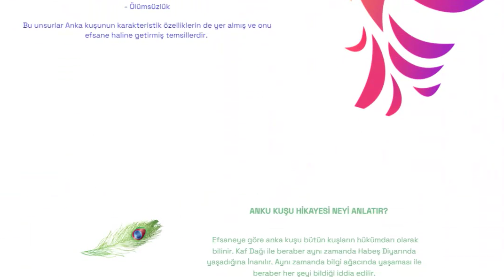

# 🦅 Phoenix Storytelling Concept

> **Archive Project | First Frontend Internship (2024)**

This project was created during my first frontend internship using **Dora**, a no-code web design platform.

Although the original editable project is no longer available, I wanted to preserve this work because it represents the beginning of my journey into interactive web experiences and storytelling through web design.

---

## ✨ About the Project

The goal of this project was to create a landing page that felt more like a short visual story than a traditional informational website.

Instead of simply displaying text, I designed an animated experience where:

- A phoenix flies across the page.
- A feather gently falls while the visitor reads the introduction.
- Animations guide the visitor's attention and create a more immersive experience.

This project introduced me to the idea that websites can tell stories, not just display information.

---

## 📸 Screenshots

> The following screenshots capture different moments of the original concept.

### Hero Section

### Phoenix Animation

### Story Progress

### Feather Animation

### Content

---

## 💡 What I Learned

Working on this project helped me explore:

- Storytelling through web design
- Animation-driven user experience
- Landing page design principles
- Visual hierarchy
- Creative thinking during my early frontend learning journey

---

## 🚀 Future Plans

I plan to rebuild this concept from scratch using modern frontend technologies, including:

- React
- Vite
- Framer Motion
- GSAP
- Responsive Design

The goal is to preserve the original idea while applying the skills I have developed since creating this first concept.

---

## 🌱 Why This Repository Exists

This repository is an archive of one of my earliest frontend concepts.

Keeping this project allows me to reflect on my progress and serves as a reminder of where my frontend journey began.

---

**Status:** Archived Concept (2024)

*A modern React remake is planned.*
